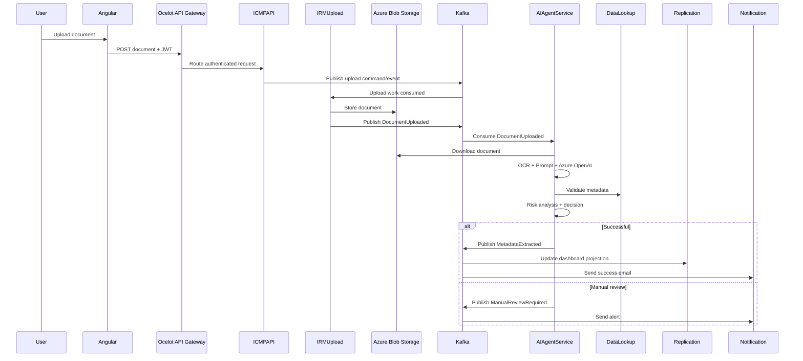
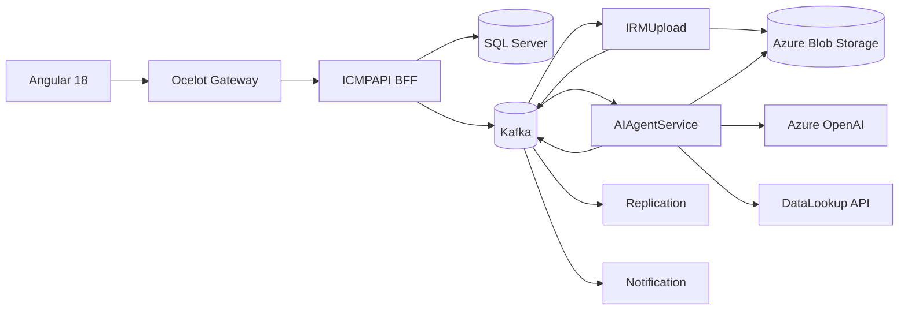

# AIAgentService

`AIAgentService` is an additive Agentic AI microservice for the Enterprise Intelligent Document Processing Platform. It does not replace ICMPAPI, IRMUpload, DataLookup, Replication, or Notification; it consumes Kafka events and publishes new AI outcomes.

## Folder structure

```text
AIAgentService
├── AIAgent.Domain          # DDD aggregate, value objects, repository contracts, domain events
├── AIAgent.Application     # CQRS commands/queries, MediatR handlers, validators, pipeline behaviors, interfaces
├── AIAgent.Infrastructure  # SQL Server, Kafka, Blob, OCR, Azure OpenAI, DataLookup, DI adapters
├── AIAgent.API             # ASP.NET Core 8 API, middleware, health checks, JWT, Serilog
├── AIAgent.Tests           # Unit test examples
├── k8s                     # AKS deployment/service yaml
└── Dockerfile              # Container packaging
```

## AI processing sequence



## Architecture diagram



## Deployment flow

```mermaid
flowchart TD
    Commit[Git commit] --> Build[CI build dotnet restore/build/test]
    Build --> Image[Docker image]
    Image --> ACR[Azure Container Registry]
    ACR --> AKS[AKS rollout]
    AKS --> Health[/health readiness and liveness]
    Health --> Splunk[Serilog logs to Splunk]
```

## Pattern implementation and benefits

| Pattern | Implemented in | Benefit |
| --- | --- | --- |
| Clean Architecture | Domain, Application, Infrastructure, API projects | Keeps business rules independent from frameworks and external systems. |
| DDD | `AiDocumentProcessingJob`, value objects, domain events | Models AI processing as a business lifecycle with audit-friendly state transitions. |
| CQRS + MediatR | `ProcessDocumentUploadedCommand`, `GetAiProcessingJobQuery`, handlers | Separates write workflows from read status queries and standardizes use-case execution. |
| Repository Pattern | `IAiDocumentProcessingJobRepository`, `AiDocumentProcessingJobRepository` | Hides SQL Server persistence from the domain and application layers. |
| Saga continuation | Consumes `DocumentUploaded` from IRMUpload and publishes success/failure events | Extends the existing distributed workflow without adding cross-service transactions. |
| Kafka | `DocumentUploadedKafkaConsumer`, `AiKafkaEventPublisher` | Provides asynchronous decoupling between IRMUpload, AI, Replication, and Notification. |
| API Gateway | Ocelot routes requests to `AIAgent.API` query endpoints | Keeps Angular/ICMPAPI communication behind a single secured entry point. |
| Dependency Injection | `AddAiAgentInfrastructure`, `Program.cs` | Enables SOLID, testability, and adapter replacement. |
| async/await | All I/O methods | Improves scalability during Blob, Kafka, SQL, HTTP, OCR, and LLM operations. |

## Why this implementation was chosen

- The service is event-driven because AI processing is long-running and should not block the upload request.
- Kafka preserves the existing microservice communication model and allows Replication and Notification to react independently.
- MediatR centralizes command/query execution, validation, and logging through pipeline behaviors.
- DDD keeps the AI processing lifecycle explicit and makes audit/history easier for enterprise document processing.
- The architecture is AKS-ready with health checks, Docker, Serilog, JWT authentication, and configuration-driven external dependencies.
